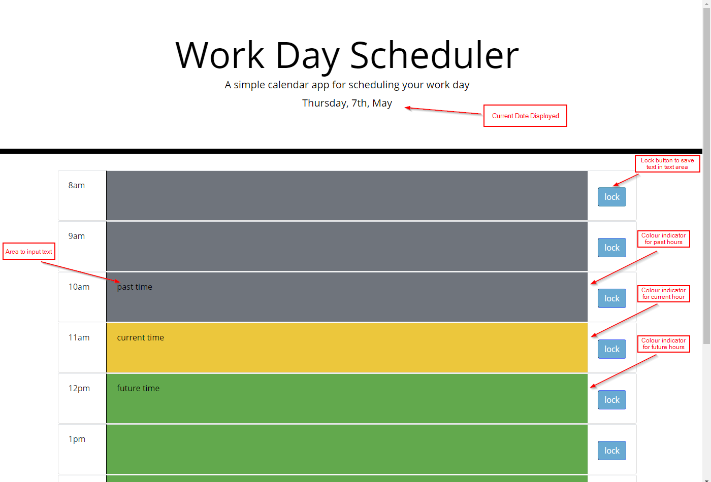

# The Work Day Scheduler

For this application, the user has requested for a calender type application specifically for work hours. The work day scheduler will indicate whether the time slot is in the past, present or future and also allows the user to save the tasks that they have put in so that they remain even after refreshing the page. 

## Functionality

- The planner will allow the user to see the date at the top (refer to image below)
- The planner has working hours of 8am - 5pm for the user to input text for tasks 
- when a user clicks on a time block, they are able to input text for tasks they have planned
- When the user clicks the 'lock' button, the text area is saved (whether after adding text or removing it) so that it even shows after refreshing the page
- When text area will be colour coded to indicate whether the time slot is in the past (grey), in the future (green) or within the current hour (yellow)
- This will update automatically if the user leaves the page open

Access the quiz here:[Workday Scheduler URL](https://christofulee.github.io/chris-homework-W5/)

## Image example of the work day scheduler

## Review

You are required to submit the following for review:

* The URL of the deployed application.

* The URL of the GitHub repository. Give the repository a unique name and include a README describing the project.

- - -
© 2019 Trilogy Education Services, a 2U, Inc. brand. All Rights Reserved.
